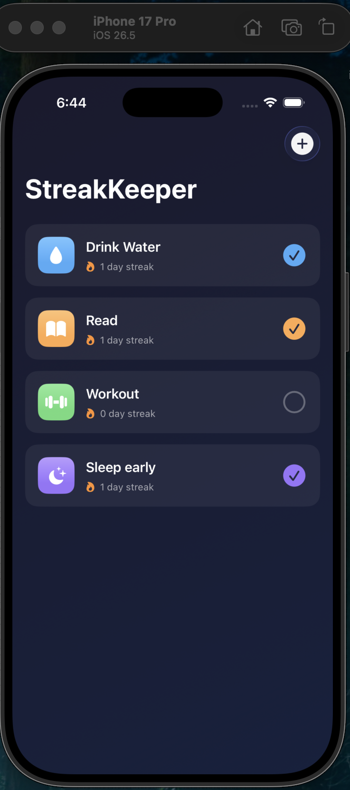
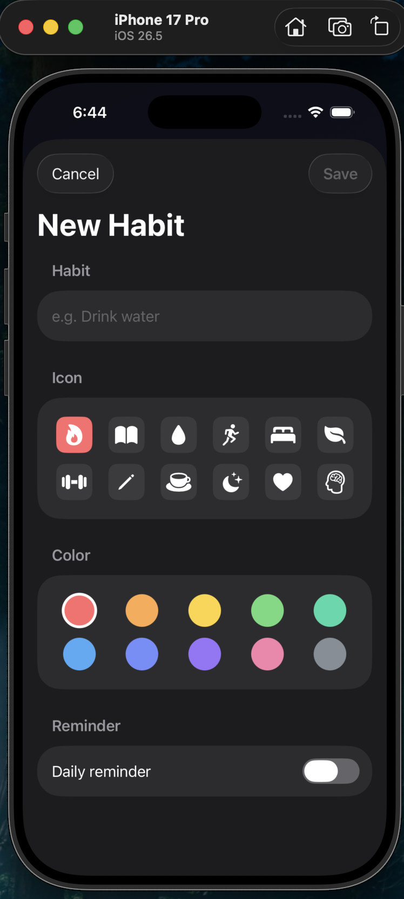
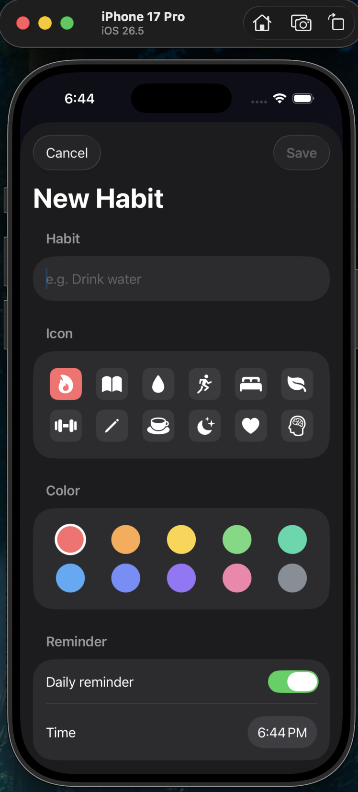
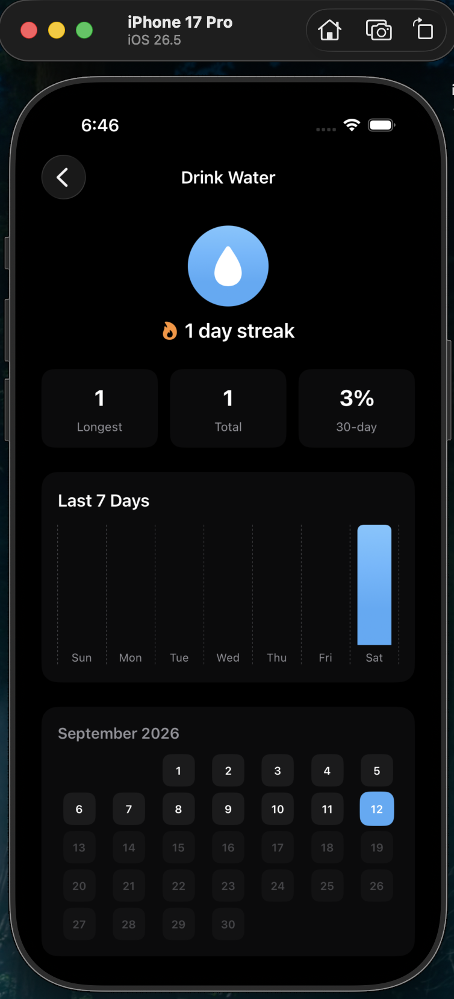
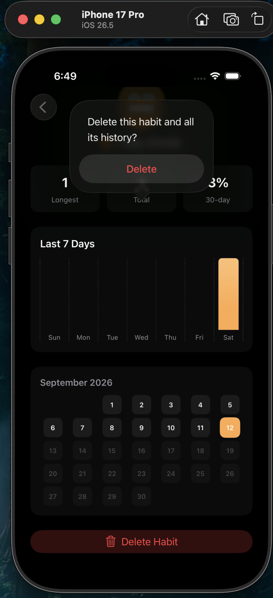

# StreakKeeper

StreakKeeper is a native iOS habit tracker built with SwiftUI and SwiftData. It lets you create habits, log daily completions, and track progress through streak counters, a calendar heatmap, and weekly charts.

## Table of Contents

- [Overview](#overview)
- [Screenshots](#screenshots)
- [Features](#features)
- [Tech Stack](#tech-stack)
- [Architecture](#architecture)
- [Requirements](#requirements)
- [Getting Started](#getting-started)
- [Project Structure](#project-structure)
- [Usage](#usage)
- [Roadmap](#roadmap)
- [License](#license)
- [Author](#author)

## Overview

StreakKeeper is a companion project to my expense tracking app, built to demonstrate a different set of iOS frameworks and architectural patterns within a portfolio: SwiftData for persistence instead of UserDefaults, Swift Charts for data visualization, and UserNotifications for local reminders.

The app is fully functional, works offline, and stores all data on-device.

## Screenshots

| Empty State | Habit List |
|:---:|:---:|
|  |  |

| Add Habit | Add Habit with Reminder |
|:---:|:---:|
|  |  |

| Habit Detail | Delete Confirmation |
|:---:|:---:|
|  |  |

## Features

- Create habits with a custom name, icon, and color
- Mark habits complete for the day with a single tap
- Automatic streak calculation (current streak and longest streak)
- 30-day completion rate per habit
- Calendar heatmap showing completion history by month
- Bar chart of completions over the last 7 days
- Optional daily local reminders per habit
- Swipe-free, single-screen habit management with a detail view per habit
- Fully offline; no account, backend, or network access required

## Tech Stack

| Layer | Technology |
|---|---|
| UI | SwiftUI |
| Persistence | SwiftData |
| Charts | Swift Charts |
| Notifications | UserNotifications (UNUserNotificationCenter) |
| Language | Swift 5.9 |
| Minimum Target | iOS 17.0 |

## Architecture

The app follows a lightweight MVVM-style structure appropriate for its scope:

- **Models** (`HabitModel.swift`) define `Habit` and `HabitLog` as SwiftData `@Model` classes, with streak and completion-rate logic computed directly on the model as derived properties.
- **Views** are split by responsibility: `ContentView` (list), `AddHabitView` (creation form), `HabitDetailView` (stats, chart, heatmap), and `StreakCalendarView` (a reusable calendar grid component).
- **Services**: `NotificationManager` wraps `UNUserNotificationCenter` for scheduling and cancelling per-habit reminders.
- **Persistence** is handled entirely through SwiftData's `ModelContainer` and `@Query`, with no manual serialization or Core Data boilerplate.

There is no networking layer and no third-party dependencies; everything ships in the standard iOS SDK.

## Requirements

- Xcode 15.0 or later
- iOS 17.0+ (required by SwiftData)
- Swift 5.9 or later

## Getting Started

### 1. Create the Xcode project

1. Open Xcode and select **File > New > Project**
2. Choose **iOS > App**
3. Set the product name to `StreakKeeper`, interface to **SwiftUI**, language to **Swift**
4. Leave storage as **None**
5. Choose a location and create the project

### 2. Set the deployment target

Select the project in the navigator, open the **General** tab, and set **Minimum Deployments** to **iOS 17.0**.

### 3. Add the source files

Remove the default `Item.swift` if one was generated. Then add the following files to the project (right-click the project group and choose **Add Files to "StreakKeeper"**), replacing the auto-generated `StreakKeeperApp.swift` and `ContentView.swift` when prompted:

```
StreakKeeperApp.swift
HabitModel.swift
ContentView.swift
AddHabitView.swift
HabitDetailView.swift
StreakCalendarView.swift
NotificationManager.swift
ColorExtension.swift
```

Ensure **Copy items if needed** is checked and the StreakKeeper target is selected before adding.

### 4. Build and run

Build with **Cmd+B** and run with **Cmd+R** on any iOS 17+ simulator or device. No additional configuration or `Info.plist` entries are required — the system notification permission prompt appears automatically the first time a reminder is scheduled.

## Project Structure

```
StreakKeeper/
├── StreakKeeperApp.swift      # App entry point, SwiftData container setup
├── HabitModel.swift           # Habit and HabitLog SwiftData models, streak logic
├── ContentView.swift          # Main habit list
├── AddHabitView.swift         # Habit creation form
├── HabitDetailView.swift      # Per-habit stats, chart, and calendar
├── StreakCalendarView.swift   # Reusable calendar heatmap component
├── NotificationManager.swift  # Local notification scheduling
├── ColorExtension.swift       # Hex color helper and palette
└── Screenshots/                # README images
```

## Usage

1. Tap the plus button to create a new habit, choosing a name, icon, color, and optional daily reminder.
2. On the main list, tap the circle beside a habit to mark it complete for the day.
3. Tap a habit to open its detail view, which shows the current and longest streak, 30-day completion rate, a 7-day chart, and a monthly calendar heatmap.
4. From the detail view, a habit can be deleted along with its full history.

## Roadmap

- Home screen widget showing today's streaks
- Swipe-to-delete on the habit list
- Haptic feedback on completion
- iCloud sync via SwiftData's CloudKit integration

## License

This project is available under the MIT License.

## Author

Ali Zoha
GitHub: [@alizoha](https://github.com/alizoha)
